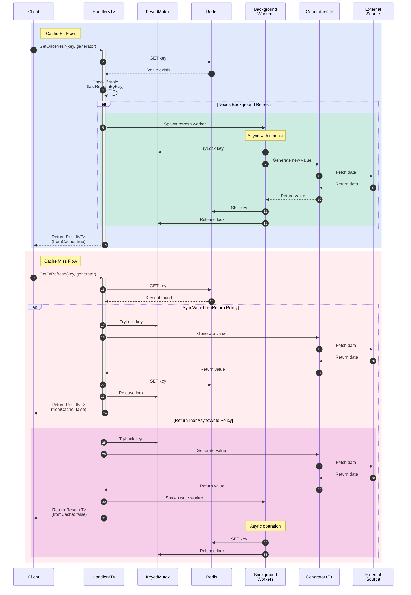

# Redis Cache Wrapper

A high-performance, type-safe Redis caching library for Go with advanced features like background refresh, cache miss policies, and automatic data generation.

## � Table of Contents

- [Redis Cache Wrapper](#redis-cache-wrapper)
  - [📚 Table of Contents](#-table-of-contents)
  - [🚀 Features](#-features)
  - [🏗️ Architecture Overview](#️-architecture-overview)
    - [System Architecture Diagram](#system-architecture-diagram)
    - [Core Components](#core-components)
    - [Data Flow](#data-flow)
  - [🔄 Cache Miss Policies](#-cache-miss-policies)
    - [Miss Policy Decision Flow](#miss-policy-decision-flow)
    - [Policy Comparison](#policy-comparison)
  - [🔒 Concurrency & Locking](#-concurrency--locking)
    - [Keyed Mutex System](#keyed-mutex-system)
  - [⏱️ Background Operations](#️-background-operations)
    - [Background Refresh Flow](#background-refresh-flow)
    - [Refresh Cooldown Mechanism](#refresh-cooldown-mechanism)
  - [📦 Installation](#-installation)
  - [🛠 Prerequisites](#-prerequisites)
  - [🛠 Development](#-development)
  - [📖 Usage](#-usage)
  - [🧪 Testing](#-testing)
  - [📊 Performance Considerations](#-performance-considerations)
  - [🛣 Roadmap](#-roadmap)
  - [📄 License](#-license)
  - [🤝 Contributing](#-contributing)
  - [📞 Support](#-support)

## �🚀 Features

- **Type Safety**: Leverages Go 1.18+ generics for compile-time type safety
- **Flexible Miss Policies**: Choose between sync and async cache miss handling
- **Background Refresh**: Automatically refresh cached data in the background reduce data staleness and use mutex to prevent cache stampede
- **Configurable TTL**: Set default and per-call TTL values
- **Thread Safety**: Built-in per-key locking prevents race conditions
- **JSON Serialization**: Automatic marshaling/unmarshaling of complex data types
- **Prefix Support**: Namespace your cache keys with configurable prefixes
- **Refresh Cooldown**: Prevent excessive background refreshes with configurable cooldowns

## 🏗️ Architecture Overview

### System Architecture Diagram

The cache system's behavior can be best understood through its interaction flows. The sequence diagram below illustrates three key scenarios:

1. **Cache Hit Flow**:
   - Initial key lookup in Redis
   - Check for staleness using lastRefreshByKey
   - Optional background refresh through Light Green section
   - Immediate return of cached value

2. **Cache Miss Flow**:
   - Two possible policies when data is not found:
     - SyncWriteThenReturn: Block until data is generated and stored
     - ReturnThenAsyncWrite: Return generated data immediately, store asynchronously in Orchid section

3. **Background Operations**:
   - Light Green section: Background refresh for stale data
   - Orchid section: Async write workers for ReturnThenAsyncWrite policy
   - Lock management via KeyedMutex to prevent cache stampede
   - Cooldown checks to prevent excessive refreshes



Key benefits of this architecture:
- **Type Safety**: Generic `Handler<T>` ensures compile-time type checking
- **Concurrency Control**: Per-key locking via `KeyedMutex` prevents cache stampede
- **Flexible Policies**: Choose between immediate consistency (sync) or better latency (async)
- **Background Refresh**: Keep cache fresh without blocking client requests
- **Cooldown Management**: Prevent excessive updates with configurable refresh intervals

### Core Components

The cache system consists of several key components working together:

#### 1. **Handler[T]** - Main Cache Interface

```
┌─────────────────────────────────────────────────────────┐
│                     Handler<T>                          │
├─────────────────────────────────────────────────────────┤
│ Fields:                                                 │
│  • config: handlerConfig                                │
│  • localLocks: keyedMutex                               │
│  • lastRefreshByKey: map[string]time.Time               │
│  • lastRefreshMu: sync.Mutex                            │
├─────────────────────────────────────────────────────────┤
│ Methods:                                                │
│  • New(rdb, opts) Handler<T>                            │
│  • Get(ctx, key) Result<T>                              │
│  • Set(ctx, key, value, opts) error                     │
│  • GetOrRefresh(ctx, key, gen, opts) Result<T>          │
└─────────────────────────────────────────────────────────┘
                              │
                              ├─── produces ───┐
                              │                │
                              ▼                ▼
        ┌─────────────────────────────┐  ┌──────────────────────┐
        │        Result<T>            │  │    Generator<T>      │
        ├─────────────────────────────┤  ├──────────────────────┤
        │ • Value: T                  │  │ Function Type:       │
        │ • FromCache: bool           │  │ func(context.Context)│
        │ • CachedAt: time.Time       │  │    (T, error)        │
        └─────────────────────────────┘  └──────────────────────┘
```

#### 2. **Configuration System**

```
Configuration Levels:

┌─────────────────────┐         ┌─────────────────────┐
│   Option Functions  │────────▶│   handlerConfig    │
└─────────────────────┘         │ (Handler Level)     │
                                ├─────────────────────┤
                                │ • rdb: *redis.Client│
                                │ • prefix: string    │
                                │ • defaultTTL        │
                                │ • bgRefreshTimeout  │
                                │ • refreshCooldown   │
                                │ • defaultMissPolicy │
                                └─────────────────────┘

┌─────────────────────┐         ┌─────────────────────┐
│CallOption Functions │────────▶│     callOpts        │
└─────────────────────┘         │  (Per-Call Level)   │
                                ├─────────────────────┤
                                │ • ttl: time.Duration│
                                │ • disableHitRefresh │
                                │ • overrideMissPolicy│
                                └─────────────────────┘
```

### Data Flow

The following shows how data flows through the cache system during different operations:

#### Cache Hit Scenario:
```
Client ──GetOrRefresh(key,gen)──▶ Handler ──Get(key)──▶ Redis
   ▲                                 │                    │
   │                                 ▼                    │
   │                           shouldRefreshNow(key)?     │
   │                                 │                    │
   │                                 ▼                    ▼
   │                            spawn background      Data exists
   │                               refresh               │
   │                                 │                   │
   │                                 ▼                   │
   │                          Background Worker          │
   │                                 │                   │
   │                                 ├─TryLock(key)      │
   │                                 ├─Generate(fresh)   │
   │                                 └─Set(key,data)─────┘
   │
   └──Result{value, fromCache: true}──────────────────┘
```

#### Cache Miss Scenario (Sync Policy):
```
Client ──GetOrRefresh(key,gen)──▶ Handler ──Get(key)──▶ Redis
   ▲                                 │                    │
   │                                 ▼                    ▼
   │                            Key not found         Key not found
   │                                 │
   │                                 ▼
   │                           Lock(key)
   │                                 │
   │                                 ▼
   │                         Get(key) [double-check] ────▶ Redis
   │                                 │                    │
   │                                 ▼                    ▼
   │                          Still not found      Still not found
   │                                 │
   │                                 ▼
   │                          Generate(data) ◄──── Generator
   │                                 │
   │                                 ▼
   │                          Set(key,data) ─────▶ Redis
   │                                 │
   │                                 ▼
   │                           Unlock(key)
   │                                 │
   └──Result{value, fromCache: false}─┘
```

## 🔄 Cache Miss Policies

The library supports two distinct strategies for handling cache misses, each optimized for different use cases.

### Miss Policy Decision Flow

```
GetOrRefresh Called
        │
        ▼
   Key exists in Redis?
        │
    ┌───┴───┐
    │       │
   Yes      No
    │       │
    ▼       ▼
[Cache Hit] [Cache Miss]
    │           │
    │           ▼
    │      Which Miss Policy?
    │           │
    │       ┌───┴───┐
    │       │       │
    │   Sync Policy Async Policy
    │       │       │
    │       ▼       ▼
    │   ┌─────────────────┐   ┌─────────────────┐
    │   │ Acquire per-key │   │ Generate data   │
    │   │ lock            │   │ immediately     │
    │   │      ▼          │   │      ▼          │
    │   │ Double-check    │   │ Return value    │
    │   │ cache           │   │      ▼          │
    │   │      ▼          │   │ Spawn background│
    │   │ Generate data   │   │ writer          │
    │   │ synchronously   │   │      ▼          │
    │   │      ▼          │   │ Try-lock and    │
    │   │ Write to Redis  │   │ write to Redis  │
    │   │      ▼          │   └─────────────────┘
    │   │ Return value    │
    │   └─────────────────┘
    │
    ▼
Background refresh enabled?
        │
    ┌───┴───┐
    │       │
   Yes      No
    │       │
    ▼       ▼
Should refresh? [Return cached value]
    │
┌───┴───┐
│       │
Yes     No
│       │
▼       ▼
[Spawn background refresh] [Return cached value]
│
▼
[Return cached value]
```

### Policy Comparison

| Aspect | SyncWriteThenReturn | ReturnThenAsyncWrite |
|--------|-------------------|---------------------|
| **Response Time** | Slower (waits for Redis write) | Faster (immediate return) |
| **Consistency** | Strong (always writes before return) | Eventual (writes in background) |
| **Cache Stampede** | Prevented (per-key locking) | Possible (multiple generators) |
| **Error Handling** | Generator errors block response | Generator errors returned immediately |
| **Resource Usage** | Lower (no extra goroutines) | Higher (background goroutines) |
| **Best For** | Critical data consistency | High-performance APIs |

```
┌─────────────────────────────────┐   ┌─────────────────────────────────┐
│        Sync Policy (Default)    │   │         Async Policy            │
├─────────────────────────────────┤   ├─────────────────────────────────┤
│                                 │   │                                 │
│  [Cache Miss] ──────────────────│   │──────────────── [Cache Miss]   │
│      │                          │   │                     │           │
│      ▼                          │   │                     ▼           │
│  [Acquire Lock]                 │   │              [Generate Data]    │
│      │                          │   │                     │           │
│      ▼                          │   │                     ▼           │
│  [Double Check]                 │   │          [Return Data           │
│      │                          │   │           Immediately] ◄────────│
│      ▼                          │   │                     │           │
│  [Generate Data]                │   │                     ▼           │
│      │                          │   │            [Background:         │
│      ▼                          │   │             Try Lock]           │
│  [Write to Redis]               │   │                     │           │
│      │                          │   │                     ▼           │
│      ▼                          │   │            [Background:         │
│  [Return Data] ◄────────────────│   │             Check & Write]      │
│                                 │   │                                 │
└─────────────────────────────────┘   └─────────────────────────────────┘
     Slower response time                    Faster response time
     Strong consistency                      Eventual consistency
     Prevents cache stampede                May allow cache stampede
```

## 🔒 Concurrency & Locking

### Keyed Mutex System

The cache uses a sophisticated per-key locking mechanism to prevent race conditions and cache stampede:

```
Request for Key X
      │
      ▼
keyedMutex.Lock(X)
      │
      ▼
Check if channel exists for Key X
      │
  ┌───┴───┐
  │       │
Exists   Does not exist
  │       │
  ▼       ▼
Use existing   Create new
channel        channel
  │       │
  └───┬───┘
      │
      ▼
Try to acquire lock
      │
      ▼
Channel available?
      │
  ┌───┴───┐
  │       │
 Yes      No
  │       │
  ▼       ▼
[Acquire lock]  [Block until available]
     │               │
     └───────┬───────┘
             │
             ▼
    [Perform cache operation]
             │
             ▼
       [Release lock]
             │
             ▼
    [Return unlock function]

Per-Key Channel Map:
┌─────────────────────────────────────┐
│ Key 'user:1'     → chan struct{}    │
│ Key 'user:2'     → chan struct{}    │
│ Key 'product:123'→ chan struct{}    │
│ ...                                 │
└─────────────────────────────────────┘
```

**Key Benefits:**
- **Prevents Cache Stampede**: Only one goroutine per key can generate data
- **Fine-grained Locking**: Different keys don't block each other
- **Memory Efficient**: Channels are created on-demand
- **Deadlock Safe**: Simple channel-based implementation

## ⏱️ Background Operations

### Background Refresh Flow

Background refresh keeps cached data fresh without blocking client requests:

```
Client ──GetOrRefresh(key,gen)──▶ Handler ──Get(key)──▶ Redis
   ▲                                 │                    │
   │                                 ▼                    ▼
   │                         shouldRefreshNow(key)?   Cached data (hit)
   │                                 │                    │
   │                                 ▼                    │
   │                          Refresh needed?            │
   │                                 │                    │
   │                                 ▼                    │
   │                         spawn background            │
   │                           refresh                    │
   │                                 │                    │
   │                                 ▼                    │
   │         ┌─────────── Background Goroutine           │
   │         │            (timeout context)              │
   │         │                     │                     │
   │         │                     ▼                     │
   │         │              TryLock(key) ─────▶ LocalLocks
   │         │                     │                     │
   │         │                     ▼                     │
   │         │              Lock acquired?               │
   │         │                     │                     │
   │         │                     ▼                     │
   │         │           Check refresh cooldown          │
   │         │                     │                     │
   │         │                     ▼                     │
   │         │            Cooldown passed?               │
   │         │                     │                     │
   │         │                     ▼                     │
   │         │           Generate fresh data ◄─── Generator
   │         │                     │                     │
   │         │                     ▼                     │
   │         │            Set(key, newData) ────▶ Redis  │
   │         │                     │                     │
   │         │                     ▼                     │
   │         │         Update lastRefresh timestamp      │
   │         │                     │                     │
   │         │                     ▼                     │
   │         └──────────── Release lock                  │
   │                                                     │
   └──Return cached data (non-blocking) ─────────────────┘
```

### Refresh Cooldown Mechanism

The cooldown mechanism prevents excessive background refreshes:

```
Background Refresh Triggered
            │
            ▼
    refreshCooldown > 0?
            │
        ┌───┴───┐
        │       │
       Yes      No
        │       │
        ▼       ▼
Check lastRefreshByKey   [Allow refresh]
       map                    │
        │                     │
        ▼                     │
Key exists in map?            │
        │                     │
    ┌───┴───┐                 │
    │       │                 │
   Yes      No                │
    │       │                 │
    ▼       └─────────────────┤
Calculate time since          │
  last refresh                │
    │                         │
    ▼                         │
time.Since(last) >= cooldown? │
    │                         │
┌───┴───┐                     │
│       │                     │
Yes     No                    │
│       │                     │
▼       ▼                     │
│   [Skip refresh] ──────┐    │
│                        │    │
└────────────────────────┼────┘
                         │
                         ▼
                  [Allow refresh]
                         │
                         ▼
                 [Perform refresh]
                         │
                         ▼
            [Update lastRefreshByKey
                  timestamp]
                         │
                         ▼
              [Return without refreshing
                  or with refresh]
```

## 📦 Installation

```bash
go get github.com/Hossein-Roshandel/cashcov
```

## 🛠 Prerequisites

- Go 1.21 or later (for generics support)
- Redis server
- `github.com/redis/go-redis/v9` client

## 🛠 Development

### Docker Development Environment

The project includes a complete Docker-based development environment for consistent development across different machines.

#### Quick Start with Docker

1. **Start the development environment:**
   ```bash
   ./docker-dev.sh up
   ```

2. **Run tests in the container:**
   ```bash
   ./docker-dev.sh test
   ```

3. **Run linting:**
   ```bash
   ./docker-dev.sh lint
   ```

4. **Access the container shell:**
   ```bash
   ./docker-dev.sh shell
   ```

#### Available Docker Commands

The `docker-dev.sh` script provides convenient commands:

```bash
./docker-dev.sh up          # Start development environment
./docker-dev.sh down        # Stop development environment
./docker-dev.sh build       # Build Docker images
./docker-dev.sh rebuild     # Rebuild from scratch
./docker-dev.sh shell       # Open container shell
./docker-dev.sh test        # Run tests
./docker-dev.sh lint        # Run linting
./docker-dev.sh logs        # Show logs
./docker-dev.sh clean       # Clean up containers
```

#### VS Code Integration

The development environment is fully integrated with VS Code:

1. **Dev Containers**: Use "Dev Containers: Reopen in Container" to develop inside Docker
2. **Debugging**: Launch configurations for local and remote debugging
3. **Tasks**: Pre-configured tasks for testing, linting, and formatting

#### What's Included

- **Go 1.25.1**: Latest Go version with full toolchain
- **Development Tools**: golangci-lint, staticcheck, goimports, pre-commit
- **Redis Server**: Local Redis instance for testing
- **Hot Reload**: Volume mounting for instant code changes
- **Debug Support**: Delve debugger configured for remote debugging

### Local Development Setup

If you prefer local development:

```bash
./setup-dev.sh
```

This installs all necessary tools and sets up pre-commit hooks.

### Quality Checks

Use the Makefile for common development tasks:

```bash
make help        # Show all available commands
make test        # Run tests
make lint        # Run linter
make fmt         # Format code
make ci          # Run all CI checks locally
```

### Code Quality Tools

- **golangci-lint**: Comprehensive linting with 30+ linters
- **gosec**: Security vulnerability scanner
- **pre-commit**: Git hooks for automatic quality checks
- **GitHub Actions**: CI/CD pipeline with testing, linting, and security scanning

## 📖 Usage

### Basic Setup

```go
package main

import (
    "context"
    "fmt"
    "time"

    "github.com/redis/go-redis/v9"
    "your-module/cache"
)

func main() {
    // Initialize Redis client
    rdb := redis.NewClient(&redis.Options{
        Addr: "localhost:6379",
    })

    // Create a type-safe cache handler for strings
    handler := cache.New[string](rdb,
        cache.WithPrefix("myapp"),
        cache.WithDefaultTTL(5*time.Minute),
        cache.WithRefreshCooldown(30*time.Second),
    )

    ctx := context.Background()

    // Basic Set/Get operations
    err := handler.Set(ctx, "user:123", "john_doe")
    if err != nil {
        panic(err)
    }

    result, err := handler.Get(ctx, "user:123")
    if err != nil {
        panic(err)
    }

    fmt.Printf("Value: %s, FromCache: %t\n", result.Value, result.FromCache)
}
```

### Advanced Usage with Data Generation

```go
type User struct {
    ID       int    `json:"id"`
    Username string `json:"username"`
    Email    string `json:"email"`
}

func main() {
    rdb := redis.NewClient(&redis.Options{Addr: "localhost:6379"})

    // Create a cache handler for User structs
    userCache := cache.New[User](rdb,
        cache.WithPrefix("users"),
        cache.WithDefaultTTL(10*time.Minute),
        cache.WithBackgroundRefreshTimeout(5*time.Second),
        cache.WithMissPolicy(cache.MissPolicySyncWriteThenReturn),
    )

    ctx := context.Background()

    // Generator function that fetches user data
    userGenerator := func(ctx context.Context) (User, error) {
        // Simulate database lookup or API call
        return User{
            ID:       123,
            Username: "john_doe",
            Email:    "john@example.com",
        }, nil
    }

    // GetOrRefresh will use cached data if available,
    // or generate and cache new data if missing
    result, err := userCache.GetOrRefresh(ctx, "123", userGenerator)
    if err != nil {
        panic(err)
    }

    fmt.Printf("User: %+v, FromCache: %t\n", result.Value, result.FromCache)
}
```

### Cache Miss Policies

#### Sync Write-Then-Return (Default)
```go
// On cache miss: generate data, write to cache, then return
result, err := handler.GetOrRefresh(ctx, "key", generator,
    cache.WithCallMissPolicy(cache.MissPolicySyncWriteThenReturn),
)
```

#### Async Return-Then-Write
```go
// On cache miss: generate and return immediately, write to cache in background
result, err := handler.GetOrRefresh(ctx, "key", generator,
    cache.WithCallMissPolicy(cache.MissPolicyReturnThenAsyncWrite),
)
```

### Configuration Options

#### Handler-Level Options
```go
handler := cache.New[string](rdb,
    cache.WithPrefix("myapp"),                           // Key prefix
    cache.WithDefaultTTL(5*time.Minute),                // Default expiration
    cache.WithBackgroundRefreshTimeout(3*time.Second),   // Background refresh timeout
    cache.WithRefreshCooldown(1*time.Minute),           // Min time between refreshes
    cache.WithMissPolicy(cache.MissPolicySyncWriteThenReturn), // Default miss policy
)
```

#### Call-Level Options
```go
result, err := handler.GetOrRefresh(ctx, "key", generator,
    cache.WithTTL(30*time.Minute),                      // Override TTL for this call
    cache.WithoutBackgroundRefresh(),                   // Disable background refresh
    cache.WithCallMissPolicy(cache.MissPolicyReturnThenAsyncWrite), // Override miss policy
)
```

## � API Reference

### Key Methods

| Component | Methods/Functions |
|-----------|------------------|
| **Handler<T>** | `New(rdb *redis.Client, opts ...Option) Handler<T>` |
|               | `Get(ctx context.Context, key string) Result<T>` |
|               | `Set(ctx context.Context, key string, value T, opts ...CallOption) error` |
|               | `GetOrRefresh(ctx context.Context, key string, gen Generator<T>, opts ...CallOption) Result<T>` |
| **Handler Options** | `WithPrefix(prefix string) Option` |
|                    | `WithDefaultTTL(ttl time.Duration) Option` |
|                    | `WithBackgroundRefreshTimeout(d time.Duration) Option` |
|                    | `WithRefreshCooldown(d time.Duration) Option` |
|                    | `WithMissPolicy(p MissPolicy) Option` |
| **Call Options** | `WithTTL(ttl time.Duration) CallOption` |
|                 | `WithoutBackgroundRefresh() CallOption` |
|                 | `WithCallMissPolicy(p MissPolicy) CallOption` |

### Method Flow Diagrams

#### GetOrRefresh Method Flow

```
GetOrRefresh Called
        │
        ▼
  [Parse CallOptions]
        │
        ▼
   [Try Redis GET]
        │
        ▼
    Cache Hit?
        │
    ┌───┴───┐
    │       │
   Yes      No
    │       │
    ▼       ▼
Check if    Determine Miss Policy
background      │
refresh         ▼
needed      Which Policy?
    │           │
    ▼       ┌───┴───┐
Should      │       │
refresh?   Sync    Async
    │       │       │
┌───┴───┐   ▼       ▼
│       │  ┌─────────────────┐   ┌─────────────────┐
Yes     No │missSyncWrite     │   │Generate + Return│
│       │  │ThenReturn       │   │+ Background     │
▼       ▼  │        │        │   │Write           │
[Spawn  [Return     ▼        │   │        │       │
bg      cached  [Acquire     │   │        ▼       │
refresh] result] per-key     │   │ [Generate data  │
│       │        lock]       │   │  immediately]  │
│       │           │        │   │        │       │
└───────┼───────────┼────────│   │        ▼       │
        │           ▼        │   │ [Return data]  │
        │    [Double-check   │   │        │       │
        │     cache]         │   │        ▼       │
        │           │        │   │ [Spawn bg      │
        │           ▼        │   │  write         │
        │    Still missing?  │   │  goroutine]    │
        │           │        │   └─────────────────┘
        │       ┌───┴───┐    │
        │       │       │    │
        │      Yes      No   │
        │       │       │    │
        │       ▼       ▼    │
        │  [Generate] [Return│
        │    data]    found] │
        │       │       │    │
        │       ▼       │    │
        │  [Write to    │    │
        │   Redis]      │    │
        │       │       │    │
        │       ▼       │    │
        │ [Return       │    │
        │  generated]   │    │
        │       │       │    │
        └───────┴───────┴────┘
                │
                ▼
        [Final Result Returned]
```

## 🔧 Advanced Configuration

### Configuration Hierarchy

The cache system uses a two-level configuration approach:

```
Handler Creation ─────────────▶ handlerConfig (Global Settings)
                                      │
                                      ├─ prefix: string
                                      ├─ defaultTTL: time.Duration
                                      ├─ bgRefreshTimeout: time.Duration
                                      ├─ refreshCooldown: time.Duration
                                      └─ defaultMissPolicy: MissPolicy

Method Call ──────────────────▶ callOpts (Call-specific Overrides)
                                      │
                                      ├─ ttl: time.Duration
                                      ├─ disableHitRefresh: bool
                                      └─ overrideMissPolicy: *MissPolicy

Configuration Priority:
┌─────────────────────────────────────────────────────────────┐
│ Call-level options override Handler-level options          │
│                                                             │
│ Example:                                                    │
│ • Handler has defaultTTL: 5 minutes                       │
│ • Call specifies WithTTL(30*time.Minute)                  │
│ • Result: 30 minutes TTL is used for this call            │
└─────────────────────────────────────────────────────────────┘
```

### Performance Tuning Guide

| Setting | Low Latency | High Throughput | Memory Efficient |
|---------|-------------|-----------------|------------------|
| **defaultTTL** | 1-5 minutes | 10-30 minutes | 1-2 minutes |
| **bgRefreshTimeout** | 1-2 seconds | 5-10 seconds | 3-5 seconds |
| **refreshCooldown** | 10-30 seconds | 1-5 minutes | 30-60 seconds |
| **defaultMissPolicy** | ReturnThenAsyncWrite | SyncWriteThenReturn | SyncWriteThenReturn |

```
Performance Goals
        │
        ▼
  Primary Concern?
        │
    ┌───┼───┐
    │   │   │
Latency │ Memory
    │   │   │
    ▼   ▼   ▼
┌─────────────────┐ ┌─────────────────┐ ┌─────────────────┐
│Fast Response    │ │High Volume      │ │Memory Efficient │
│Configuration    │ │Configuration    │ │Configuration    │
├─────────────────┤ ├─────────────────┤ ├─────────────────┤
│• Short TTL      │ │• Longer TTL     │ │• Short TTL      │
│• Quick timeouts │ │• Longer timeouts│ │• Long cooldowns │
│• Async miss     │ │• Sync miss      │ │• Sync miss      │
│  policy         │ │  policy         │ │  policy         │
└─────────────────┘ └─────────────────┘ └─────────────────┘
   Prioritizes        Prioritizes        Prioritizes
   low latency       high throughput     low memory usage
```

## 🎯 Use Cases

### Web Applications
```go
// Cache expensive database queries
func GetUserProfile(userID string) (User, error) {
    return userCache.GetOrRefresh(ctx, userID, func(ctx context.Context) (User, error) {
        return fetchUserFromDatabase(userID)
    })
}
```

### API Response Caching
```go
// Cache external API responses
func GetWeatherData(city string) (Weather, error) {
    return weatherCache.GetOrRefresh(ctx, city, func(ctx context.Context) (Weather, error) {
        return callWeatherAPI(city)
    }, cache.WithTTL(30*time.Minute))
}
```

### Computational Results
```go
// Cache expensive calculations
func GetAnalyticsReport(params AnalyticsParams) (Report, error) {
    key := fmt.Sprintf("analytics:%s", params.Hash())
    return reportCache.GetOrRefresh(ctx, key, func(ctx context.Context) (Report, error) {
        return generateAnalyticsReport(params)
    })
}
```

## 🧪 Testing

The package includes comprehensive tests with Redis mocking:

```bash
go test -v
```

Key test scenarios:
- Basic Set/Get operations
- Cache hits and misses
- Background refresh functionality
- Concurrent access safety
- JSON marshaling/unmarshaling
- Error handling
- Refresh cooldown behavior

## 📊 Performance Considerations

### Memory Usage
- Keyed mutexes are kept in memory for active keys
- Background goroutines are spawned for async operations
- Refresh timestamps are tracked for cooldown functionality

### Concurrency
- Per-key locking prevents cache stampede
- Background operations don't block main execution
- Thread-safe operations across all methods

### Redis Operations
- Efficient use of Redis commands (GET, SET, EXISTS)
- JSON marshaling overhead for complex types
- Configurable timeouts for all operations

## 🛣 Roadmap

### Planned Features
- [ ] **Metrics & Observability**: Built-in metrics for hit rates, generation times, and error rates
- [ ] **Circuit Breaker**: Automatic fallback when cache or generators fail repeatedly
- [ ] **Cache Warming**: Pre-populate cache with commonly accessed data
- [ ] **Batch Operations**: Support for getting/setting multiple keys efficiently
- [ ] **Custom Serializers**: Support for non-JSON serialization (protobuf, msgpack, etc.)
- [ ] **Cache Tagging**: Group related cache entries for bulk invalidation
- [ ] **LRU Eviction**: Local in-memory LRU cache layer for ultra-fast access
- [ ] **Distributed Locking**: Replace local locks with Redis-based distributed locks
- [ ] **Configuration Validation**: Compile-time and runtime configuration validation
- [ ] **Cache Compression**: Optional compression for large cached values

### Performance Improvements
- [ ] **Connection Pooling**: Optimize Redis connection usage
- [ ] **Pipelining**: Batch Redis operations for better throughput
- [ ] **Memory Optimization**: Reduce memory footprint of internal structures
- [ ] **Hot Key Detection**: Identify and optimize frequently accessed keys

### Developer Experience
- [ ] **Middleware Integration**: Built-in middleware for popular Go frameworks
- [ ] **CLI Tools**: Command-line utilities for cache management and debugging
- [ ] **Monitoring Dashboard**: Web UI for cache statistics and management
- [ ] **Documentation**: Interactive examples and best practices guide
- [ ] **Benchmarking Suite**: Performance testing and comparison tools

### Enterprise Features
- [ ] **Multi-Region Support**: Cross-region cache synchronization
- [ ] **Access Control**: Key-level permissions and authentication
- [ ] **Audit Logging**: Detailed logging of cache operations
- [ ] **Backup/Restore**: Tools for cache data backup and recovery
- [ ] **Rate Limiting**: Built-in rate limiting for cache operations

## 📄 License

MIT License ?

## 🤝 Contributing

Contributions are welcome!

1. Fork the repository
2. Create your feature branch (`git checkout -b feature/amazing-feature`)
3. Commit your changes (`git commit -m 'Add amazing feature'`)
4. Push to the branch (`git push origin feature/amazing-feature`)
5. Open a Pull Request

## 📞 Support

- Create an issue for bug reports or feature requests
- Check existing issues before creating new ones
- Provide minimal reproduction cases for bugs

## 🔗 Related Open Source Packages

This section lists other open source caching libraries and their approach to cache miss policies for reference and comparison.

### Go Caching Libraries

#### [patrickmn/go-cache](https://github.com/patrickmn/go-cache)
- **Focus**: In-memory caching with expiration
- **Miss Policies**: Basic expiration-based eviction
- **Notable Features**: Thread-safe, cleanup intervals
- **Use Case**: Simple in-memory caching without Redis

#### [allegro/bigcache](https://github.com/allegro/bigcache)
- **Focus**: High-performance in-memory cache
- **Miss Policies**: LRU-based eviction, no custom miss handling
- **Notable Features**: Zero GC overhead, fast concurrent access
- **Use Case**: High-throughput in-memory caching

#### [dgraph-io/ristretto](https://github.com/dgraph-io/ristretto)
- **Focus**: High-performance cache with admission control
- **Miss Policies**: TinyLFU admission policy, cost-based eviction
- **Notable Features**: Probabilistic admission control, metrics
- **Use Case**: Smart caching with admission control

#### [coocood/freecache](https://github.com/coocood/freecache)
- **Focus**: Zero GC overhead cache
- **Miss Policies**: LRU eviction, basic expiration
- **Notable Features**: Off-heap storage, no GC pressure
- **Use Case**: Large-scale in-memory caching

### Multi-Language Caching Solutions

#### [ben-manes/caffeine](https://github.com/ben-manes/caffeine) (Java)
- **Focus**: High-performance Java caching library
- **Miss Policies**:
  - Refresh-ahead (similar to our `MissPolicyRefreshAhead`)
  - Async refresh (similar to our `MissPolicyReturnThenAsyncWrite`)
  - Custom loading strategies
- **Notable Features**: W-TinyLFU admission, async loading
- **Comparison**: Most similar to our approach with multiple miss policies

#### [Netflix/EVCache](https://github.com/Netflix/EVCache) (Java)
- **Focus**: Distributed caching for AWS
- **Miss Policies**:
  - Fail-fast patterns (similar to our `MissPolicyFailFast`)
  - Cross-region replication
  - Bulk loading strategies
- **Notable Features**: Multi-zone replication, monitoring
- **Use Case**: Large-scale distributed caching

#### [Twitter/twemcache](https://github.com/twitter/twemcache) (C)
- **Focus**: Memcached fork with additional features
- **Miss Policies**: Custom eviction policies, slab allocation
- **Notable Features**: Better memory management than memcached
- **Use Case**: High-performance memcached replacement

### Redis-Specific Libraries

#### [go-redis/cache](https://github.com/go-redis/cache) (Go)
- **Focus**: Simple Redis caching with marshaling
- **Miss Policies**: Basic cache-aside pattern only
- **Notable Features**: Multiple serialization formats
- **Comparison**: Simpler approach, no advanced miss policies

#### [vmihailenco/msgpack](https://github.com/vmihailenco/msgpack) + Redis (Go)
- **Focus**: Efficient serialization for Redis
- **Miss Policies**: Manual implementation required
- **Notable Features**: Fast binary serialization
- **Use Case**: When serialization performance is critical

#### [muesli/cache2go](https://github.com/muesli/cache2go) (Go)
- **Focus**: Concurrency-safe in-memory caching
- **Miss Policies**: Callback-based loading, expiration
- **Notable Features**: Data loading callbacks, access counting
- **Comparison**: Similar callback approach but in-memory only

### Web Framework Cache Middleware

#### [gin-contrib/cache](https://github.com/gin-contrib/cache) (Go/Gin)
- **Focus**: HTTP response caching middleware
- **Miss Policies**: Simple cache-aside with TTL
- **Notable Features**: Redis and in-memory backends
- **Use Case**: HTTP response caching

#### [labstack/echo-contrib](https://github.com/labstack/echo-contrib) (Go/Echo)
- **Focus**: Echo framework middleware collection
- **Miss Policies**: Basic caching middleware
- **Notable Features**: Multiple storage backends
- **Use Case**: Web framework integration

### Academic and Research Projects

#### [Guava Cache](https://github.com/google/guava) (Java)
- **Focus**: Google's core Java libraries
- **Miss Policies**:
  - LoadingCache with refresh-ahead
  - Probabilistic eviction
  - Size and time-based eviction
- **Notable Features**: Statistical tracking, concurrent loading
- **Comparison**: Similar refresh strategies to our implementation

#### [Varnish Cache](https://github.com/varnishcache/varnish-cache) (C)
- **Focus**: HTTP accelerator and reverse proxy
- **Miss Policies**:
  - Stale-while-revalidate (similar to our `MissPolicyStaleWhileRevalidate`)
  - Grace mode (serving stale content)
  - Custom VCL policies
- **Notable Features**: VCL scripting language, HTTP-specific optimizations
- **Comparison**: Web-focused but similar stale-while-revalidate concept

### Industry-Specific Solutions

#### [Shopify/go-lua](https://github.com/Shopify/go-lua) + Redis Lua Scripts
- **Focus**: Custom Redis scripting for complex cache logic
- **Miss Policies**: Custom Lua-based policies
- **Notable Features**: Server-side logic execution
- **Use Case**: Complex cache policies requiring server-side logic

#### [bradfitz/gomemcache](https://github.com/bradfitz/gomemcache) (Go)
- **Focus**: Pure Go memcached client
- **Miss Policies**: Basic memcached operations only
- **Notable Features**: Simple, reliable memcached access
- **Use Case**: When memcached is preferred over Redis

## Key Differentiators of This Package

| Feature | This Package | Other Go Libraries | Notes |
|---------|-------------|-------------------|-------|
| **Generic Type Safety** | ✅ Full generics support | ❌ Most use interface{} | Compile-time type safety |
| **Advanced Miss Policies** | ✅ 8 different policies | ❌ Usually 1-2 basic patterns | Industry-leading policy variety |
| **Stale-While-Revalidate** | ✅ Built-in SWR support | ❌ Rare in Go libraries | Common in web caching |
| **Probabilistic Refresh** | ✅ Configurable beta parameter | ❌ Not commonly implemented | Load distribution |
| **Refresh-Ahead** | ✅ TTL-based proactive refresh | ❌ Limited implementations | Prevents cache misses |
| **Cooperative Refresh** | ✅ Anti-stampede with timeout | ⚠️ Basic locking only | Advanced concurrency control |
| **Per-Key Locking** | ✅ Fine-grained mutex system | ⚠️ Often global locks | Reduces contention |
| **Comprehensive Config** | ✅ Handler + call-level options | ❌ Usually basic config | Maximum flexibility |

### Inspiration and Research Sources

This implementation draws inspiration from:
- **Caffeine** (Java) - Multi-policy approach and refresh-ahead
- **Varnish** - Stale-while-revalidate concepts
- **Netflix EVCache** - Fail-fast and distributed patterns
- **Academic papers** on probabilistic caching and cache stampede prevention
- **CDN technologies** like Cloudflare and Fastly for SWR patterns
- **Database caching patterns** from high-scale web applications

### Performance Comparisons

While we haven't conducted formal benchmarks against all libraries, our design focuses on:
- **Lower allocation overhead** through generics (vs interface{} casting)
- **Reduced lock contention** via per-key locking (vs global locks)
- **Better miss handling** through diverse policy options
- **Improved cache hit rates** via proactive refresh strategies

---

Built with ❤️ for the Go community
