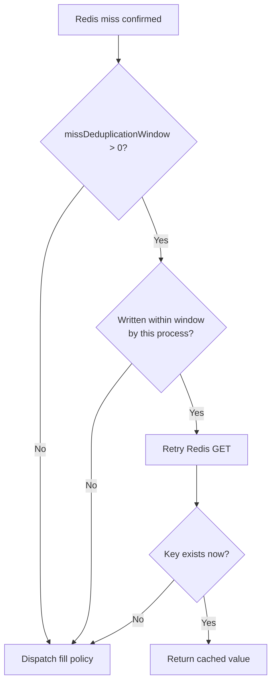

# Cache Behaviour Policies

This document describes the three independent policy axes that control cache behaviour in the cache package. They replace the old single `MissPolicy` enum with a composable design.

## Three-Axis Model

Cache behaviour is controlled by three **independent** types. All three can be set at the handler level (defaults) and overridden per call.

| Axis | Type | Handler option | Call option |
|------|------|---------------|-------------|
| Miss-fill | `MissFillPolicy` | `WithMissFillPolicy` | `WithCallMissFillPolicy` |
| Hit-refresh | `HitRefreshPolicy` | `WithDefaultHitRefreshPolicy` | `WithCallHitRefreshPolicy` |
| Error handling | `ErrorPolicy` | `WithDefaultErrorPolicy` | `WithCallErrorPolicy` |

---

## Miss-Fill Policies (`MissFillPolicy`)

Controls what happens when `GetOrRefresh` finds no data in the cache.

### `MissFillDefault` (zero value)
Alias for `MissFillSync`. The zero value of the type; allows distinguishing "not set" from "explicitly sync".

### `MissFillSync`
| Attribute | Value |
|-----------|-------|
| Latency on miss | Higher (blocks until generation + write completes) |
| Consistency | Strong — caller always receives freshly written data |
| Stampede protection | Excellent — per-key in-process lock + double-check |
| Best for | Financial data, user-specific records, anything requiring consistency |

**Flow**: acquire in-process lock → double-check cache → generate → write to Redis → return.

### `MissFillAsync`
| Attribute | Value |
|-----------|-------|
| Latency on miss | Lowest — returns immediately |
| Consistency | Eventual — cache is written in background |
| Stampede protection | Poor on first miss wave; see `WithMissDeduplicationWindow` below |
| Best for | High-throughput read APIs where brief consistency lag is acceptable |

**Flow**: generate → return value → background goroutine tries-locks → double-checks → writes.

> **Stampede note**: The background write deduplicates concurrent **writes** via a try-lock, but the **generator** is called by every concurrent miss in the first wave. Set `WithMissDeduplicationWindow` to suppress duplicate generation after the first write.

### `MissFillStaleOrSync`
| Attribute | Value |
|-----------|-------|
| Latency on miss | Low when stale data exists; falls back to `MissFillSync` latency otherwise |
| Consistency | Eventual when stale data is served |
| Stampede protection | Good (background lock for refresh; sync lock when no stale data) |
| Best for | Content delivery, web pages, dashboards where slightly stale data is acceptable |

**Requires**: `WithStaleDataTTL` set on the handler. Without it the stale key always misses and behaviour is identical to `MissFillSync`.

**Flow (stale data exists)**: return stale value immediately → spawn background refresh (writes both main and `:stale` keys).

**Flow (no stale data)**: delegate to `MissFillSync`.

### `MissFillFailFast`
| Attribute | Value |
|-----------|-------|
| Latency on miss | Minimal — no generation attempted |
| Consistency | N/A |
| Stampede protection | N/A |
| Best for | Circuit-breaker patterns; explicit fallback logic in the caller |

**Flow**: return `ErrCacheMiss` immediately. Generator is never called.

> `ErrCacheMiss` is never suppressed by `ErrorPolicyZeroValue` — it is an intentional signal.

### `MissFillCooperative`
| Attribute | Value |
|-----------|-------|
| Latency on miss | Medium — waiting callers block up to `WithCooperativeTimeout` |
| Consistency | Strong — all concurrent callers receive the same generated value |
| Stampede protection | Excellent — at most one generator call per key at a time |
| Best for | Expensive generation (DB queries, external API calls) under high concurrency |

**Flow**: attempt to acquire in-process lock with a timeout (from `WithCooperativeTimeout`).
- **Lock acquired**: run `MissFillSync` flow.
- **Timeout elapsed**: generate immediately without caching to avoid blocking indefinitely.

---

## Hit-Refresh Policies (`HitRefreshPolicy`)

Controls proactive background refresh when the key **is found** in the cache. Completely independent of the miss-fill policy.

### `HitRefreshDefault` (zero value)
Standard background refresh triggered on every cache hit, gated by the configured `refreshCooldown`. Uses `shouldRefreshNow` (last-refresh timestamp check).

### `HitRefreshAhead`
Triggers a background refresh only when the remaining TTL of the cached key drops below a configurable threshold (e.g. 20% of the original TTL remaining).

Configure with `WithRefreshAheadThreshold(0.2)` (handler-level) or a per-call `refreshAheadThreshold` field.

**Best for**: workloads with predictable TTLs and a desire to eliminate cold misses entirely.

### `HitRefreshProbabilistic`
Uses the **XFetch algorithm**: the probability of triggering an early refresh increases continuously as the entry ages relative to its TTL. No coordination is needed between processes.

Formula: `random() < (age / TTL) * beta`

Configure sensitivity with `WithProbabilisticBeta(1.0)`. Higher beta → more aggressive early refresh.

**Best for**: large fleets where you want refresh load distributed stochastically rather than creating a synchronised spike at TTL boundary.

**Requires**: a `@created` timestamp recorded at fill time. This is done automatically inside `GetOrRefresh` when this policy is active.

### `HitRefreshOlderThan`
| Attribute | Value |
|-----------|-------|
| Trigger | Entry age exceeds a configured duration |
| Coordination | None |
| Best for | Workloads with a known acceptable staleness window |

Triggered when the entry's age (time since the `@created` metadata tag was written) exceeds the configured threshold. Unlike `HitRefreshAhead` (which is relative to remaining TTL), this is an absolute age check.

Configure with `WithRefreshOlderThanAge(d time.Duration)` (handler-level default) or `WithCallRefreshOlderThanAge(d time.Duration)` (per-call override).

**Best for**: time-sensitive data where you want a guaranteed maximum staleness regardless of TTL, such as exchange rates, live scores, or inventory levels.

**Requires**: a `@created` timestamp recorded at fill time. This is done automatically inside `GetOrRefresh` when this policy is active.

### `HitRefreshNone`
Disables all background refresh on cache hits. The entry will expire at TTL and be regenerated on the next miss.

**Best for**: read-heavy data where staleness is acceptable and background goroutines are undesirable.

---

## Error Policy (`ErrorPolicy`)

Controls what the caller receives when the generator returns an error.

### `ErrorPolicySurface` (zero value / default)
The generator error is wrapped and returned to the caller unchanged. This is the safe default.

### `ErrorPolicyZeroValue`
Generator errors are suppressed. The caller receives a zero-valued `Result[T]` with `err == nil`.

**Use for**: non-critical features (e.g. recommendation widgets, auxiliary metadata) where returning empty is preferable to surfacing an error.

> `ErrCacheMiss` (from `MissFillFailFast`) is **never** suppressed — it is a control-flow signal, not a generation failure.

---

## Generation Deduplication (`WithMissDeduplicationWindow`)

A cross-cutting option that reduces duplicate generator calls for any miss-fill policy, most impactful with `MissFillAsync`.

### How it works

When a Redis miss is confirmed, before invoking the fill policy the handler checks an in-process timestamp map (`lastRefreshByKey`):

1. Was this key written by **this process** within the configured window?
2. **Yes** → retry `GET` once. If the key is now in Redis (written by a concurrent goroutine), return it without calling the generator.
3. **No** (key still absent — evicted, TTL elapsed again) → proceed to the fill policy as normal.



### Effect on stampede

| Scenario | Without window | With window |
|----------|---------------|-------------|
| First concurrent miss wave (no prior write) | All goroutines call generator | All goroutines call generator (unavoidable) |
| Subsequent waves within window | All goroutines call generator | Most goroutines skip generator, return cached value |
| Key evicted inside window | All goroutines call generator | Goroutines retry GET; on miss, call generator |

### Limitation: window is clamped to effective TTL

The deduplication window is clamped to the call's effective TTL at runtime:

```
effective_window = min(missDeduplicationWindow, ttl)
```

Setting a window longer than the TTL is a no-op for the extra duration — the key cannot survive in Redis beyond its TTL, so any window exceeding it adds no protection. This clamping happens automatically; no configuration error is raised.

Example: TTL is 2 minutes, window is 5 minutes → effective window is 2 minutes.

### Limitation: in-process only

`lastRefreshByKey` is an in-memory map. It does not coordinate across pods. Each pod independently suppresses duplicate generation. For cross-pod deduplication, use `MissFillCooperative` with a distributed lock (planned roadmap item).

### Usage

```go
// Most effective with MissFillAsync
cache.New[Product](rdb,
    cache.WithMissFillPolicy(cache.MissFillAsync),
    cache.WithMissDeduplicationWindow(5*time.Minute),
)

// Also useful with MissFillSync as a second line of defence
cache.New[User](rdb,
    cache.WithMissFillPolicy(cache.MissFillSync),
    cache.WithMissDeduplicationWindow(2*time.Minute),
)
```

---

Because the axes are independent you can express any combination:

```go
// Fast APIs: async fill + refresh-ahead + surface errors
cache.New[Product](rdb,
    cache.WithMissFillPolicy(cache.MissFillAsync),
    cache.WithDefaultHitRefreshPolicy(cache.HitRefreshAhead),
    cache.WithRefreshAheadThreshold(0.2),
)

// Time-sensitive data: sync fill + older-than refresh + surface errors
cache.New[Price](rdb,
    cache.WithMissFillPolicy(cache.MissFillSync),
    cache.WithDefaultHitRefreshPolicy(cache.HitRefreshOlderThan),
    cache.WithRefreshOlderThanAge(30*time.Second),
)

// Dashboard widgets: stale-while-revalidate + probabilistic hit refresh + zero value on error
cache.New[Stats](rdb,
    cache.WithMissFillPolicy(cache.MissFillStaleOrSync),
    cache.WithStaleDataTTL(24*time.Hour),
    cache.WithDefaultHitRefreshPolicy(cache.HitRefreshProbabilistic),
    cache.WithProbabilisticBeta(1.0),
    cache.WithDefaultErrorPolicy(cache.ErrorPolicyZeroValue),
)

// Critical data: sync fill + no hit refresh + surface errors (all defaults)
cache.New[Invoice](rdb,
    cache.WithMissFillPolicy(cache.MissFillSync),
    cache.WithDefaultHitRefreshPolicy(cache.HitRefreshNone),
)

// Circuit-breaker: fail-fast fill + explicit fallback in caller
result, err := handler.GetOrRefresh(ctx, key, generator,
    cache.WithCallMissFillPolicy(cache.MissFillFailFast),
)
if errors.Is(err, cache.ErrCacheMiss) {
    result = fallback()
}
```

---

## Quick-Reference Comparison

### Miss-Fill

| Policy | Miss latency | Consistency | Stampede protection |
|--------|-------------|-------------|---------------------|
| `MissFillSync` | High | Strong | Excellent |
| `MissFillAsync` | Lowest | Eventual | Poor |
| `MissFillStaleOrSync` | Low / High* | Eventual / Strong* | Good |
| `MissFillFailFast` | Minimal | N/A | N/A |
| `MissFillCooperative` | Medium | Strong | Excellent |

\* Low latency + eventual consistency when stale data exists; High latency + strong consistency when it does not.

### Hit-Refresh

| Policy | Trigger | Coordination |
|--------|---------|--------------|
| `HitRefreshDefault` | Every hit (cooldown-gated) | None |
| `HitRefreshAhead` | TTL < threshold | None |
| `HitRefreshProbabilistic` | Probabilistic (age-based) | None |
| `HitRefreshOlderThan` | Entry age > threshold | None |
| `HitRefreshNone` | Never | N/A |

### Error Handling

| Policy | Generator error | `ErrCacheMiss` |
|--------|----------------|----------------|
| `ErrorPolicySurface` | Returned to caller | Returned to caller |
| `ErrorPolicyZeroValue` | Suppressed (zero value) | Returned to caller |
