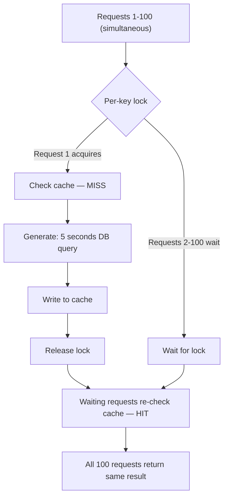
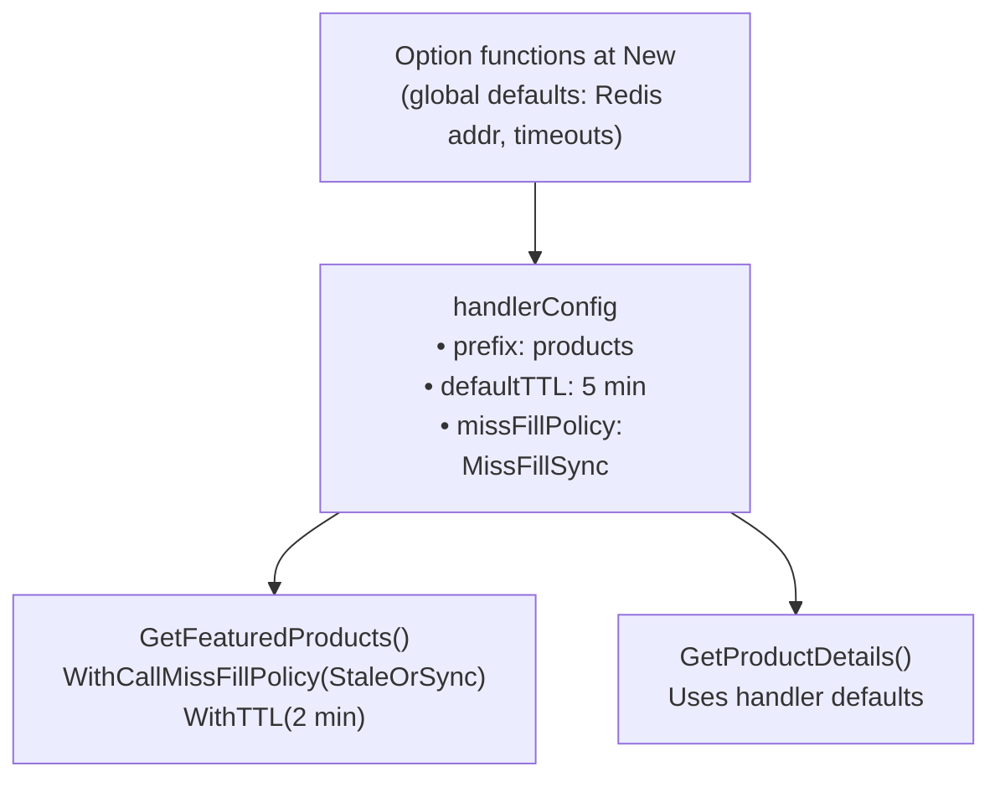

#TODO: I am still workign on what policies I want to implement. Likely I will focus on **SyncWriteThenReturn** and **ReturnThenAsyncWrite** only. This doc is an initial draft and must be updated accordingly.

# Cashcov Use Cases

Cashcov is a Redis-backed caching wrapper designed for Go services that need more than basic key/value storage. It combines type-safe handlers, per-key locking, background refresh, and configurable cache-miss policies so teams can describe intent explicitly instead of re-implementing caching patterns in every call site. This document outlines where Cashcov is a strong fit and where another approach is likely better.

---

## When Cashcov Shines

### 1. Time-Based Caches That Must React to Early Data Changes

**Scenario**: You have data cached with a 30-minute TTL, but the underlying data might change at any time. You want to detect and serve fresh data quickly without waiting for the TTL to expire.

**How Cashcov Helps**: Use `HitRefreshAhead (use WithDefaultHitRefreshPolicy)` or background refresh to proactively update cached values. Per-key locking ensures only one generator runs per key, avoiding duplicate database queries.

```go
type Product struct {
    ID          string    `json:"id"`
    Name        string    `json:"name"`
    Price       float64   `json:"price"`
    LastUpdated time.Time `json:"last_updated"`
}

// Set up handler with refresh-ahead policy
productCache := cache.New[Product](rdb,
    cache.WithPrefix("products"),
    cache.WithDefaultTTL(30*time.Minute),
    cache.WithRefreshAheadThreshold(0.2), // Refresh when 20% TTL remains (6 min)
    cache.WithRefreshCooldown(1*time.Minute),
    cache.WithMissFillPolicy(cache.HitRefreshAhead (use WithDefaultHitRefreshPolicy)),
)

// Generator function that fetches from database
productGenerator := func(ctx context.Context) (Product, error) {
    return db.GetProduct(ctx, productID)
}

// First call: Cache miss, fetches from DB
product, err := productCache.GetOrRefresh(ctx, "prod-123", productGenerator)
// Result: FromCache=false, fetched from DB

// Subsequent calls within TTL: Return cached instantly
product, err = productCache.GetOrRefresh(ctx, "prod-123", productGenerator)
// Result: FromCache=true, instant return

// After 24 minutes (80% of TTL): Triggers background refresh
product, err = productCache.GetOrRefresh(ctx, "prod-123", productGenerator)
// Result: FromCache=true, instant return + background DB fetch updates cache
```

**Timeline Visualization**:

| Time | Event | Action |
|------|-------|--------|
| 0 min | Cache MISS | Fetch from DB, write cache |
| 6 min | Cache HIT | Serve cached value |
| 24 min | Cache HIT + background refresh | Serve cached value; refresh triggered at ~20% TTL remaining |
| 30 min | Cache EXPIRED | Fetch from DB, write cache |

### 2. High Fan-Out Reads of the Same Source Data

**Scenario**: Multiple clients request the same data simultaneously (e.g., trending product, popular article). Without coordination, each request would hit your database or API.

**How Cashcov Helps**: Per-key locking ensures only one generator runs. Other concurrent requests wait for the first to complete and share the result.

```go
type TrendingReport struct {
    TopProducts []Product `json:"top_products"`
    GeneratedAt time.Time `json:"generated_at"`
}

// Heavy computation that takes 5 seconds
func generateTrendingReport(ctx context.Context) (TrendingReport, error) {
    // Expensive aggregation query across millions of records
    return db.ComputeTrendingProducts(ctx, time.Now().Add(-24*time.Hour))
}

reportCache := cache.New[TrendingReport](rdb,
    cache.WithPrefix("trending"),
    cache.WithDefaultTTL(5*time.Minute),
    cache.WithMissFillPolicy(cache.MissFillSync), // Strong consistency
)

// Scenario: 100 requests arrive simultaneously for the same report
// Without Cashcov: 100 database queries = 500 seconds total DB time
// With Cashcov: 1 database query, 99 requests wait and share result
```

**Concurrent Request Flow**:



> Total DB time: **5 seconds** (not 500 seconds)

**Code Example**:
```go
// Simulate 100 concurrent requests
var wg sync.WaitGroup
start := time.Now()

for i := 0; i < 100; i++ {
    wg.Add(1)
    go func(reqID int) {
        defer wg.Done()

        result, err := reportCache.GetOrRefresh(ctx, "daily-trending",
            generateTrendingReport)

        if err != nil {
            log.Printf("Request %d failed: %v", reqID, err)
            return
        }

        log.Printf("Request %d completed: FromCache=%v", reqID, result.FromCache)
        // First request: FromCache=false (generated)
        // Other 99: FromCache=true (shared from first)
    }(i)
}

wg.Wait()
elapsed := time.Since(start)
// Elapsed: ~5 seconds (not 500 seconds)
```

### 3. UX That Can Tolerate Occasional Staleness

**Scenario**: E-commerce inventory display where users can refresh the page to see updated stock. Initial load must be fast (<100ms), but showing slightly outdated inventory is acceptable since users will refresh or proceed to checkout where real-time validation occurs.

**How Cashcov Helps**: `MissFillStaleOrSync` or `MissFillAsync` return immediately and update in the background.

```go
type InventoryStatus struct {
    ProductID       string `json:"product_id"`
    AvailableStock  int    `json:"available_stock"`
    ReservedStock   int    `json:"reserved_stock"`
    LastChecked     time.Time `json:"last_checked"`
}

inventoryCache := cache.New[InventoryStatus](rdb,
    cache.WithPrefix("inventory"),
    cache.WithDefaultTTL(2*time.Minute),
    cache.WithStaleDataTTL(1*time.Hour), // Keep stale data for fallback
    cache.WithMissFillPolicy(cache.MissFillStaleOrSync),
)

// API endpoint for product page
func GetInventoryHandler(w http.ResponseWriter, r *http.Request) {
    productID := r.URL.Query().Get("product_id")

    result, err := inventoryCache.GetOrRefresh(r.Context(), productID,
        func(ctx context.Context) (InventoryStatus, error) {
            return warehouseAPI.CheckStock(ctx, productID) // 500ms API call
        })

    if err != nil {
        http.Error(w, "Failed to fetch inventory", http.StatusInternalServerError)
        return
    }

    // Response time: <10ms if cached, even if data is being refreshed
    json.NewEncoder(w).Encode(result.Value)
}
```

**User Experience Flow**:

| Scenario | Response time | Notes |
|----------|--------------|-------|
| Visit #1 — cold miss | ~500 ms | API call required |
| Visit #2 — within TTL | ~5 ms | Cache HIT |
| Visit #3 — stale data exists | ~8 ms | Return stale + background refresh |
| Visit after background refresh | ~5 ms | Fresh data from background fetch |
| Checkout (critical path) | real-time | Cache bypassed; warehouse checked directly |

**Policy Comparison** (Scenario: cache has 2-minute-old inventory data):

| Policy | Response time | Data freshness |
|--------|--------------|----------------|
| `MissFillSync` | ~500 ms | Always current |
| `MissFillStaleOrSync` | ~8 ms | Up to 2 min stale (next request: fresh) |

### 4. Rarely Changing Datasets with Long Cache Windows

**Scenario**: Monthly payroll dashboard that aggregates millions of records. Query takes 5 seconds, but data only changes once per month. Dashboard must feel instant (<100ms) but should show new data as soon as it's available.

**How Cashcov Helps**: Long TTL (30 days) with background refresh means the dashboard loads instantly, and the first access after data updates will refresh the cache in the background.

```go
type PayrollDashboard struct {
    Month            string  `json:"month"`
    TotalPayroll     float64 `json:"total_payroll"`
    EmployeeCount    int     `json:"employee_count"`
    DepartmentBreakdown map[string]float64 `json:"department_breakdown"`
    GeneratedAt      time.Time `json:"generated_at"`
}

dashboardCache := cache.New[PayrollDashboard](rdb,
    cache.WithPrefix("payroll-dashboard"),
    cache.WithDefaultTTL(30*24*time.Hour), // 30 days
    cache.WithBackgroundRefreshTimeout(30*time.Second),
    cache.WithRefreshCooldown(5*time.Minute),
    cache.WithMissFillPolicy(cache.MissFillSync),
)

func generateDashboard(ctx context.Context, month string) (PayrollDashboard, error) {
    // Heavy aggregation: 5 seconds
    return db.AggregatePayrollData(ctx, month)
}

// Manager views dashboard
func DashboardHandler(w http.ResponseWriter, r *http.Request) {
    month := r.URL.Query().Get("month") // e.g., "2025-10"

    result, err := dashboardCache.GetOrRefresh(r.Context(), month,
        func(ctx context.Context) (PayrollDashboard, error) {
            return generateDashboard(ctx, month)
        },
        cache.WithTTL(30*24*time.Hour),
    )

    json.NewEncoder(w).Encode(result.Value)
}
```

**User Experience Timeline**:

| Date | Cache state | Response time | Notes |
|------|------------|--------------|-------|
| Nov 1 — first access | MISS | ~5 s | Cold start; DB query required |
| Nov 1–30 | HIT | ~10 ms | All accesses served from cache |
| Dec 1 — data updated | HIT | ~10 ms | Stale October data served; background refresh starts |
| Dec 1 — next access | HIT | ~10 ms | Fresh November data available |

With `HitRefreshAhead` (`refresh_ahead_threshold=0.2`): background refresh triggers at Day 24 (80% of TTL elapsed), ensuring fresh data is available before Dec 1.

**Performance Comparison** (100 dashboard views per day):

| | Without caching | With cashcov |
|---|---|---|
| DB time per day | 100 × 5 s = **500 s** | Day 1: 5 s; Days 2–30: ~0 s |
| DB time per month | 15,000 s (4.2 h) | **~6 s total** |
| User experience | 5 s wait every time | 10 ms after first load |
| DB load reduction | — | **99.96 %** |

### 5. Statistically Accurate, Non-Critical Aggregates

**Scenario**: Nearest gas stations with operating hours. Query returns 10 stations. If one station's hours are wrong, it's acceptable—users can see updated data on refresh, and subsequent users benefit from the correction.

**How Cashcov Helps**: Cache all station data with reasonable TTLs. Occasional mismatches self-correct through normal cache refresh cycles. Probabilistic refresh prevents all popular keys from refreshing simultaneously.

```go
type GasStation struct {
    ID        string    `json:"id"`
    Name      string    `json:"name"`
    Location  Location  `json:"location"`
    Hours     string    `json:"hours"`
    LastCheck time.Time `json:"last_check"`
}

type NearbyStations struct {
    Latitude  float64      `json:"latitude"`
    Longitude float64      `json:"longitude"`
    Stations  []GasStation `json:"stations"`
}

stationCache := cache.New[NearbyStations](rdb,
    cache.WithPrefix("gas-stations"),
    cache.WithDefaultTTL(1*time.Hour),
    cache.WithProbabilisticBeta(1.5), // Earlier refresh for popular locations
    cache.WithMissFillPolicy(cache.HitRefreshProbabilistic (use WithDefaultHitRefreshPolicy)),
)

// Find stations near user location
func FindNearbyStations(ctx context.Context, lat, lon float64) (NearbyStations, error) {
    // Round to ~1km grid for cache efficiency
    gridKey := fmt.Sprintf("%.2f,%.2f", lat, lon)

    return stationCache.GetOrRefresh(ctx, gridKey,
        func(ctx context.Context) (NearbyStations, error) {
            return db.QueryNearbyStations(ctx, lat, lon, 10) // Top 10
        })
}
```

**Accuracy vs Performance Trade-off**:

| Time | Event |
|------|-------|
| T+0:00 | Hours changed in DB (7am–10pm → 6am–11pm); cache unchanged |
| T+0:15 | User A queries — cache HIT, old hours returned ⚠️ |
| T+0:30 | Probabilistic refresh triggers; background fetch updates cache |
| T+0:35 | User B queries — cache HIT, correct hours ✅ |
| T+1:00+ | All users see correct hours |

**Statistical Correctness**:

Dataset: 10 stations per query, TTL: 1 hour, ~1 station updates hours per day.

- Stations updating per hour: 1 ÷ 24 ≈ 0.042
- Chance of seeing outdated data per query: 0.042 ÷ 10 ≈ **0.42 %**
- Accuracy: **99.58 %** ✅

Even if inaccurate: not safety-critical, self-corrects within 1 hour.

**Probabilistic Refresh Distribution**:

```mermaid
xychart-beta
    title "Refresh load over time"
    x-axis [0:00, 0:45, 1:00, 1:15, 1:30, 2:00, 2:30, 3:00]
    y-axis "Relative DB load" 0 --> 10
    bar [0, 0, 10, 0, 0, 10, 0, 10]
    line [0, 2, 3, 2, 1, 3, 1, 2]
```

Without `HitRefreshProbabilistic`: all keys expire at the same TTL boundary, causing a thundering herd (spikes at 1:00, 2:00, 3:00). With `HitRefreshProbabilistic` (beta=1.5): refreshes are staggered — popular keys refresh earlier, load stays smooth.

**Code with Probabilistic Refresh**:
```go
// Popular downtown location (many queries)
result1, _ := stationCache.GetOrRefresh(ctx, "downtown-grid-1", generator)
// High traffic → Higher probability of early refresh → Stays fresher

// Suburban location (few queries)
result2, _ := stationCache.GetOrRefresh(ctx, "suburb-grid-42", generator)
// Low traffic → Lower probability of early refresh → Refreshes at TTL

// This naturally prioritizes keeping popular data fresh
// while not wasting resources on rarely accessed data
```

### 6. Teams That Need Explicit Caching Policies in Code

**Scenario**: Microservices team where different endpoints have different caching needs. Product catalog needs strong consistency, while blog posts can use stale-while-revalidate. Policy should be visible in code reviews.

**How Cashcov Helps**: Handler options and call options make policies explicit, self-documenting, and easy to review.

```go
// service/cache/handlers.go
package cache

// Critical: Product pricing must be consistent
var ProductCache = cache.New[Product](rdb,
    cache.WithPrefix("products"),
    cache.WithDefaultTTL(5*time.Minute),
    cache.WithMissFillPolicy(cache.MissFillSync), // ← Explicit policy
    cache.WithRefreshCooldown(30*time.Second),
)

// Non-critical: Blog posts can be stale
var BlogCache = cache.New[BlogPost](rdb,
    cache.WithPrefix("blog"),
    cache.WithDefaultTTL(15*time.Minute),
    cache.WithStaleDataTTL(24*time.Hour),
    cache.WithMissFillPolicy(cache.MissFillStaleOrSync), // ← Different policy
)

// Time-sensitive: Flash sale inventory
var FlashSaleCache = cache.New[SaleInventory](rdb,
    cache.WithPrefix("flash-sale"),
    cache.WithDefaultTTL(30*time.Second), // Short TTL
    cache.WithMissFillPolicy(cache.MissFillFailFast), // ← Fail fast, handle explicitly
)
```

**Code Review Benefits**:
```diff
// Pull Request: Add caching to expensive analytics endpoint

+ analyticsCache := cache.New[AnalyticsReport](rdb,
+     cache.WithPrefix("analytics"),
+     cache.WithDefaultTTL(1*time.Hour),
+     cache.WithMissFillPolicy(cache.MissFillAsync), // ← Reviewer can question
+ )

Reviewer Comment:
"Why ReturnThenAsyncWrite? Analytics reports are expensive to generate.
If we have a cache stampede, we'll hit the DB multiple times.
Consider MissFillCooperative or MissFillSync."

Developer Response:
"Good catch! Changed to CooperativeRefresh. The 2-second wait is
acceptable, and it prevents duplicate 10-second DB queries."

+ analyticsCache := cache.New[AnalyticsReport](rdb,
+     cache.WithPrefix("analytics"),
+     cache.WithDefaultTTL(1*time.Hour),
+     cache.WithCooperativeTimeout(5*time.Second),
+     cache.WithMissFillPolicy(cache.MissFillCooperative), // ← Better choice
+ )
```

**Policy Override at Call Site**:
```go
// Default: Products use sync policy
func GetProduct(ctx context.Context, id string) (Product, error) {
    return ProductCache.GetOrRefresh(ctx, id, productGenerator)
    // Uses handler default: MissFillSync
}

// Special case: Homepage featured products can be slightly stale for speed
func GetFeaturedProducts(ctx context.Context) ([]Product, error) {
    ids := []string{"featured-1", "featured-2", "featured-3"}
    products := make([]Product, 0, len(ids))

    for _, id := range ids {
        product, err := ProductCache.GetOrRefresh(ctx, id, productGenerator,
            // Override policy for homepage performance
            cache.WithCallMissFillPolicy(cache.MissFillStaleOrSync), // ← Explicit override
            cache.WithTTL(2*time.Minute), // ← Shorter TTL for featured items
        )
        if err != nil {
            continue // Skip failed products on homepage
        }
        products = append(products, product.Value)
    }

    return products, nil
}
```

**Policy Documentation in Code**:
```go
// pkg/handlers/products.go

// GetProductDetails retrieves product information with strong consistency.
// Policy: MissFillSync
//   - Ensures price consistency across all users
//   - Prevents cache stampede with per-key locking
//   - Acceptable latency: First miss takes ~500ms (DB query)
//   - Subsequent hits: <10ms
func GetProductDetails(w http.ResponseWriter, r *http.Request) {
    productID := mux.Vars(r)["id"]

    result, err := ProductCache.GetOrRefresh(r.Context(), productID,
        func(ctx context.Context) (Product, error) {
            return db.FetchProduct(ctx, productID)
        })
    // Policy choice documented in function docstring ✅
}

// GetBlogPost retrieves blog content with stale-while-revalidate.
// Policy: MissFillStaleOrSync
//   - Prioritizes fast page load (<50ms)
//   - Accepts showing slightly outdated content
//   - Background refresh keeps content reasonably fresh
//   - Not suitable for: Breaking news, time-sensitive content
func GetBlogPost(w http.ResponseWriter, r *http.Request) {
    slug := mux.Vars(r)["slug"]

    result, err := BlogCache.GetOrRefresh(r.Context(), slug,
        func(ctx context.Context) (BlogPost, error) {
            return cms.FetchBlogPost(ctx, slug)
        })
    // Policy clearly states trade-offs ✅
}
```

**Configuration Hierarchy Visualization**:



Developer intent is clear at every level — policy decisions surface in code review.

## When to Look Elsewhere

- **Mission-critical accuracy (financial transactions, compliance events)**  \
  If 100% correctness is mandatory and stale responses are unacceptable, skip caching or use a design that guarantees truth-at-read, such as always hitting the source of record.

- **Zero tolerance for statistical error**  \
  Life-safety systems, fraud detection, or SLAs that forbid stale outputs conflict with Cachecov’s willingness to serve cached data before refresh completes.

- **Low-latency data sources that do not benefit from caching**  \
  If the upstream query is already fast, the added complexity of policies, background workers, and Redis management is unnecessary overhead.

- **Workloads that demand cross-region or distributed locking today**  \
  Current design relies on local per-key mutexes. The roadmap calls out distributed coordination as future work, so choose a different approach if you need it immediately.

- **Environments where Redis is unavailable or undesirable**  \
  Cashcov assumes a Redis backend. For purely in-memory caches, minimal HTTP response caching, or CDN-style policies, pick tools specialized for those cases.

---

## Anti-Patterns: When NOT to Use Cashcov

### ❌ Financial Transactions

```go
// ❌ DANGEROUS
func ProcessPayment(accountID string, amount float64) error {
    balance, _ := balanceCache.GetOrRefresh(ctx, accountID, fetchBalance)
    if balance.Value < amount {
        return ErrInsufficientFunds // Stale balance!
    }
    return executePayment(accountID, amount)
}

// ✅ CORRECT
func ProcessPayment(accountID string, amount float64) error {
    balance, _ := db.GetBalanceForUpdate(ctx, accountID) // Real-time
    if balance < amount {
        return ErrInsufficientFunds
    }
    return executePayment(accountID, amount)
}
```

### ❌ Already-Fast Data Sources

If your query is <10ms, caching adds overhead:
```
Direct:  App → Redis → 2ms ✅
Cached:  App → Cashcov → Redis → 7ms ❌ (slower!)
```

### ❌ Zero-Error-Tolerance Systems

Not suitable for: Medical devices, fraud detection, autonomous vehicles, legal compliance.

### ❌ Multi-Instance Without Distributed Locks (Current Limitation)

```
3 instances, cache miss:
Instance 1: Generate ❌
Instance 2: Generate ❌  (stampede!)
Instance 3: Generate ❌
```
Distributed locking is on the roadmap.

---

## Decision Checklist

✅ Does the caller tolerate bounded staleness? → **Use Cashcov**
✅ Are upstream calls slow/expensive? → **Use Cashcov**
✅ Need explicit policies in code? → **Use Cashcov**
✅ Need background refresh or SWR? → **Use Cashcov**

❌ Need 100% accuracy always? → **Skip caching**
❌ Source already <10ms? → **Skip caching**
❌ Need distributed locks today? → **Wait for roadmap or use alternatives**

Cashcov balances freshness and performance with clear, policy-driven behavior. Use it where those trade-offs match your product requirements, and keep critical paths on direct reads.
